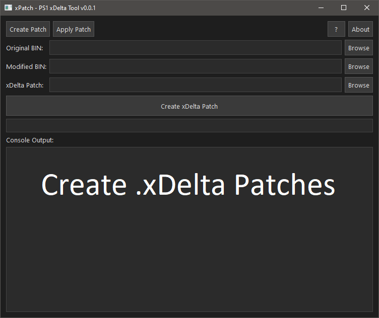
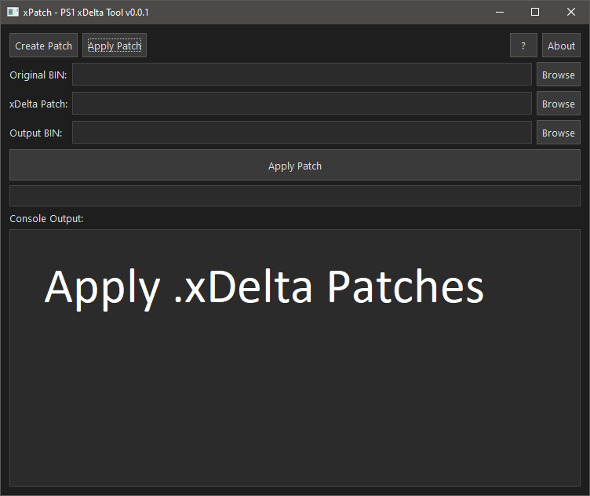
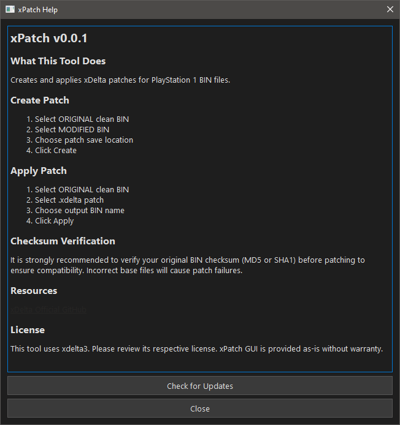

# xPatch   

A simple command-line tool to **create and apply `.xDelta` patches for PlayStation 1 games** — perfect for ROM hacking, mod distribution, and patch management.

This is the initial release **v0.0.1**.  
[Download Release](https://github.com/JeevesGB/xPatch/releases/tag/xPatchv0.0.1)

---

## 🚀 Features

- Create `.xDelta` patch files from original and modified PS1 game data.
- Apply `.xDelta` patches to original game images.
- Lightweight with minimal dependencies — easy to include in workflows.
- Designed for modders and preservationists working with PS1 ISOs and binary diffs.

---

## 🧠 What is an `.xDelta` Patch?

`.xDelta` patches are **binary diff files** storing changes between two versions of a file.  
They enable:

- Distributing only the changes (much smaller than full ISOs)
- Applying modifications without sharing copyrighted game data
- Widely used in retro gaming and ROM hack communities

---

## Screenshots

## Building
run build.bat

## Credits

- xDelta3: https://github.com/jmacd/xdelta

## Licence 
This project is licensed under the MIT License.